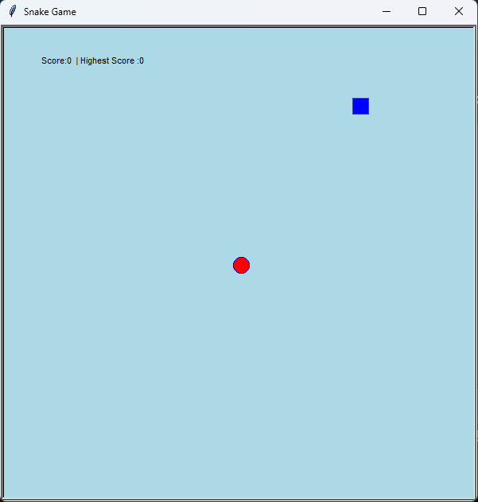

## @Made by Sonu Vishwakarma

# Project Title : Snake Game in Python

## Description
This is a simple **Snake Game** implemented using Python's **Turtle** module. The game features basic mechanics like controlling the snake, collecting food, and growing in size. The game ends when the snake collides with its own body or the border.

### Features:
- Control the snake with the arrow keys.
- Snake grows longer as it eats food.
- The score increases as the snake eats food.
- The game restarts when the snake collides with itself.
- Score and highest score displayed on the screen.

## Table of Contents
- [Installation](#installation)
- [Usage](#usage)
- [How to Play](#how-to-play)
- [Game Controls](#game-controls)
- [License](#license)
- [Contact](#contact)
- [Output Screen](#output-screen)

---

## Installation
1. Clone the repository: `git clone https://github.com/sonuvishwakarmavns/snakegame.git`
2. Navigate to the project directory: `cd snakegame`
3. Install dependencies: `pip install -r requirements.txt`
4. Start the project: `snakegame.py`

## Usage
1 . **Import following items :** 
       
    
    import turtle
    import random
    import time

## How to Play    
      
    1.Eat the red square (food) to increase your score.
    2.Avoid running into the walls and your own snake body.
    3.The game resets when the snake collides with its own body, and your score resets to 0.
    4.The game speed gradually increases as your score goes up.

## Game Controls
    Up Arrow: Move the snake up.
    Down Arrow: Move the snake down.
    Left Arrow: Move the snake left.
    Right Arrow: Move the snake right.
    Space Bar: (Optional) Pause the game (if you choose to implement a pause feature).

### Explanation:
- The content is organized into sections that describe the game, installation steps, how to play, and guidelines.
- Each section uses standard Markdown formatting for headings (`#`), code blocks (with triple backticks), and lists (`-`).
  
## License
This project is licensed under the MIT License - see the LICENSE file for details.

## Contact
Your Name - [sonu.vishwakarma1487@gmail.com](mailto:email@example.com)

## Output Screen

